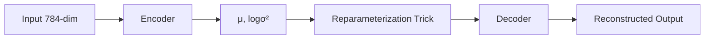
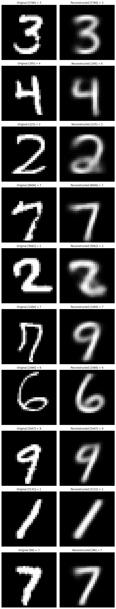
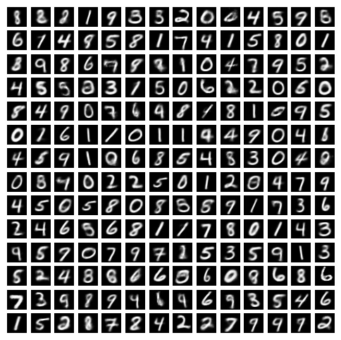

# **Scratch Variational AutoEncoder: Fully-Connected MNIST VAE (From Scratch Implementation)**


[](https://www.python.org/)
[](https://pytorch.org/)
[](LICENSE)


A research-grade, from-scratch implementation of a **fully-connected Variational AutoEncoder (VAE)** trained on the **MNIST** dataset, including a **custom LinearLayer**, **μ/logσ² heads**, **reparameterization trick**, **IDX dataloader**, **training pipeline**, **sampling module**, and **reconstruction visualization**.

As with the AutoEncoder project:
No `torchvision`, no shortcuts every part is implemented manually for full mathematical transparency.

---

## **Table of Contents**

* [Overview](#overview)
* [Repository Structure](#repository-structure)
* [Model Architecture](#model-architecture)
* [Installation](#installation)
* [How to Run](#how-to-run)

  * [Train](#1-train-the-vae)
  * [Visualize](#2-visualize-reconstructions)
  * [Sample](#3-generate-samples-from-latent-space)
* [Expected Outputs](#expected-outputs)
* [Configuration](#configuration)
* [References](#references)
* [License](#license)

---

# **Overview**

This project contains a **full Variational AutoEncoder pipeline implemented entirely from scratch**, covering:

* Custom `LinearLayer` with Xavier initialization
* Encoder producing (μ, logσ²)
* **Reparameterization Trick**:
  `z = μ + σ ⊙ ε` where `ε ∼ N(0, I)`
* Two-layer **decoder**, generating reconstructed images
* Raw MNIST IDX parsing (no torchvision)
* Full ELBO loss implementation:

  * Negative log-likelihood (reconstruction)
  * KL-divergence term
* Latent space **sampling & visualization**

---

# **Repository Structure**

```
scratch-variational-autoencoder/
├── LICENSE
├── README.md
├── vae_weights.pth
├── data/
├── docs/
│   ├── reconstructions.png
│   └── samples.png
├── notebooks/
│   ├── vae.ipynb
│   └── mnist_reader.ipynb
├── requirements.txt
└── src/
    ├── __init__.py
    ├── config.py
    ├── data_loader.py
    ├── layers.py
    ├── model.py
    ├── klloss.py
    ├── train.py
    ├── reconstruct_images.py
    ├── generate_new_image.py.py
```

---

# **Model Architecture**

### **Custom Linear Layer**

Fully manual weight–bias module with **Xavier uniform initialization**.

```python
LinearLayer(in_features → out_features)
```

---

### **Encoder**

Outputs **two heads**:

```
784 → 256 → 8 → (μ, logσ²)
```

Both activations: `Sigmoid` (except heads which are linear).

---

### **Reparameterization Trick**

```
z = μ + exp(0.5 * logσ²) * ε      where ε ~ N(0, I)
```

Ensures gradients flow through random sampling.

---

### **Decoder**

```
8 → 256 → 784
```

Sigmoid activation for final output.

---

### **VAE Pipeline**



---

# **Installation**

```bash
git clone https://github.com/Himanshu7921/scratch-variational-autoencoder
cd scratch-variational-autoencoder
pip install -r requirements.txt
```

Place MNIST IDX files inside:

```
./data/
```

---

# **How to Run**

All commands assume:

```
scratch-variational-autoencoder/
```

---

## **1. Train the VAE**

```bash
python -m src.train
```

This will:

* Load MNIST IDX files
* Apply normalization + flattening
* Train the VAE for **200 epochs**
* Save model weights:

```
vae_weights.pth
```

---

## **2. Visualize Reconstructions**

```bash
python -m src.reconstruct_images
```

Outputs a grid showing:

* MNIST original images
* Reconstructed images

Saved as:

```
./docs/regenerated_images.png
```

---

## **3. Generate Samples from Latent Space**

```bash
python -m src.generate_new_image
```

This draws random `z ∼ N(0, I)` and generates new MNIST-like digits:

```
./docs/sample.jpeg
```

---

# **Expected Outputs**

### **Training Logs**

```
Epoch 1, Recon Loss: xx, KL: xx, Total: xx
Epoch 5, Recon Loss: xx, KL: xx, Total: xx
...
Epoch 200, Recon Loss: xx, KL: xx, Total: xx
```

---

### **Reconstruction Example**




---

### **Generated Samples**


---


# **Configuration**

All hyperparameters live in:
`src/config.py`

| Parameter    | Value             |
| ------------ | ----------------- |
| `input_dim`  | `28*28`           |
| `hidden_dim` | `256`             |
| `latent_dim` | `8`               |
| `batch_size` | `128`             |
| `lr`         | `0.001`           |
| `epochs`     | `300`             |
| `beta`       | `1.0` (KL weight) |
| `input_path` | `./data`          |

---

# **References**

### Core VAE Theory

* **Kingma, D.P., Welling, M.** *Auto-Encoding Variational Bayes*. ICLR 2014.
* **Rezende, D.J.**, *Stochastic Backpropagation and Approximate Inference*. ICML 2014.
* [“An Introduction to Variational Autoencoders”](https://arxiv.org/pdf/1906.02691)
* [“Auto-Encoding Variational Bayes”](https://arxiv.org/pdf/1312.6114)

### Additional Literature

1. Doersch, C. *Tutorial on VAEs*. arXiv:1606.05908
2. Townsend, J. *From Scratch VAE Derivations*
3. Cremer, C. *Inference Suboptimality in VAEs*. ICML 2018

---

# **Citation**

If this implementation is used in academic or research work:

```bibtex
@software{Singh_VAE_2026,
  author = {Himanshu Singh},
  title  = {Fully-Connected Variational AutoEncoder for MNIST: A Research Implementation},
  year   = {2026},
  url    = {https://github.com/Himanshu7921/scratch-variational-autoencoder}
}
```

---

# **License**

This project is licensed under the **MIT License**.
You are free to use, modify, and distribute this code with attribution.